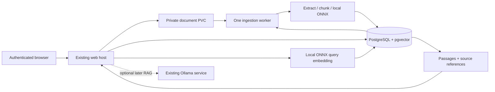

# Local document search — technical design

Status: proposal only. Repository inspected on 23 September 2026. No application, package, database, Docker or Helm changes are part of this document.

## 1. Current architecture and verified assumptions

The repository contains one `net10.0` ASP.NET Core web project, `Chatbot.csproj`. `Program.cs` registers MVC controllers, Blazor Interactive Server, Google cookie authentication, OpenAPI, and a typed `HttpClient` for `IOllamaClient`. Existing namespaces mix `Chatbot` and `AIPlatform.Api`; avoid an unrelated namespace migration.

Relevant evidence:

| File | Current behaviour and design implication |
| --- | --- |
| `Components/App.razor`, `Pages/Home.razor` | Interactive Server UI; Home calls `IOllamaClient` directly and appends streamed strings. It no longer calls its own HTTP API. |
| `Controllers/ChatController.cs` | Authenticated `POST /api/chat`, streamed `text/plain`, cancellation forwarded to Ollama. Keep its contract intact. |
| `Services/OllamaClient.cs` | Sends one user message to Ollama `/api/chat`; reads newline-delimited responses. No embedding, retrieval, conversation persistence or system/context message abstraction. |
| `Services/ChatbotGoogleSessionHandler.cs` | Copies Google's subject into `NameIdentifier`; no local users or session database. This supplies a stable ownership key, unlike email. |
| `Chatbot.csproj` | No EF Core, vector, document parser or inference packages. No test projects found. |
| `Dockerfile`, `.github/workflows/container-image.yml` | .NET 10 Linux image build, GitHub package credentials passed as a BuildKit secret, persistent `/keys`. Runtime user is not explicitly restricted. |
| `charts/chatbot/templates/ollama.yaml` | Separate Ollama Deployment and ClusterIP Service, model PVC, default Qwen3 1.7B, readiness/liveness probes. |
| `charts/chatbot/values.yaml` | Ollama requests 2 GiB and limits 3 GiB; model disk 5 GiB. App resources are unset. |
| `templates/deployment.yaml`, `httproute.yaml` | App Deployment, credentials from a Secret, key PVC, Gateway API route referencing Envoy Gateway namespace; no app health probes. |

The README reports an 8 GB CPU-only node, Qwen using approximately 1.9 GB, and about 2.3 GiB available at the time of measurement. These are historical observations, not current measurements. RKE2 and Cloudflare Tunnel are deployment context supplied by the user; this repository does not define the cluster or tunnel. ClusterIP does not itself prevent other pods from reaching Ollama: no NetworkPolicy is present here.

No current dependency on an external AI API was found. Google login and external CSS/font loading are separate existing network dependencies; “local processing” here means document contents, embeddings and inference stay within the deployment, not that the entire existing app is air-gapped.

## 2. Proposed architecture and decisions

Recommend PostgreSQL with pgvector, a small ONNX embedding model invoked from .NET, PDF/TXT ingestion, and exact document-filtered cosine search. Search returns passages and provenance; it never calls Ollama.

Use a shared documents library and a small ingestion worker process. The web host handles upload, metadata, query embedding and retrieval. The worker extracts, chunks and embeds documents. Both use the same model artifact and library implementation. This costs a second model session but isolates a malformed PDF, excessive parser allocation or stalled inference from existing interactive chat.



Do not introduce Semantic Kernel, LangChain, a message broker, Redis, an embedding HTTP service or an agent framework. These pipelines need a few explicit calls, not autonomous orchestration.

Alternatives evaluated:

| Choice | Decision |
| --- | --- |
| PostgreSQL + pgvector | Recommended: relational ownership, jobs and vectors share transactions and one operational dependency. |
| SQLite and managed exact-vector scan | Lower operational footprint, credible for a single user; less convenient for separate processes, concurrent jobs and future multiuser growth. Fallback if measured memory does not fit. |
| Dedicated vector database | Additional stateful service without enough value for small per-document searches. |
| HNSW immediately | Defer: a few thousand document chunks can be searched exactly without an extra graph index or approximate filtering behaviour. |
| Ollama embedding model | Excluded from v1 because search must work with Ollama stopped. |
| Worker inside web process | Saves memory, but PDF parsing/OOM would take down chat. Prefer isolation; measure two-session cost before deployment. |

Scope: English machine-readable PDFs and UTF-8 TXT, one selected document per search, owner-only access. No OCR, URL imports, sharing, cross-document search, DOCX, reranker, conversational retrieval or AI synthesis in v1.

## 3. Ingestion sequence

1. Authenticate and resolve server-side user identity. Check feature availability, per-user quota, concurrent upload and pending-job limits.
2. Stream multipart bytes into a random temporary file on the document PVC. Enforce the byte limit while streaming; calculate SHA-256. Never load the whole upload into a byte array or trust `Content-Length`.
3. Validate extension, declared type and content signature/encoding. Reserve quota before accepting concurrent writes. File validation is preliminary; the worker performs complete parser validation.
4. Create `Document` in `Uploading` state, referencing a generated storage key. Move the temporary file atomically to the final location on the same filesystem. In a short database transaction, create an ingestion generation/job and mark it `Queued`. Only then return `202` and a status URL.
5. A reconciliation loop removes abandoned temporary files and repairs/expires `Uploading` rows. File storage and PostgreSQL cannot commit atomically. Return an existing owned document for duplicate content and remove the redundant upload.
6. Worker claims one job with a short `FOR UPDATE SKIP LOCKED` transaction; commits a lease, attempt ID and expiry. No database transaction remains open during inference.
7. Extract one page/block at a time, enforce page/text limits, normalize text with provenance, then chunk using the model's tokenizer. Write staging chunks to the new generation in small batches.
8. Embed bounded batches, normalize/check vectors and persist them. Maintain progress counters, heartbeat and cancellation checks between pages and batches.
9. Validate completeness. In one transaction, lock/check document and lease, ensure it is not deleted/cancelled, verify all expected chunks have embeddings, then replace `ActiveGenerationId`. Mark the job successful. Only this publication makes new chunks searchable.
10. Remove superseded generations asynchronously after publication. Their storage remains accounted for until cleanup finishes.

Keep one active job per document. Delivery is at least once: unique generation/ordinal keys and lease fencing make retries safe. A worker with an expired lease must not write or publish after another worker takes over.

## 4. Search sequence and later RAG

1. Authenticate and load the owned document; return indistinguishable `404` for absent and foreign documents.
2. Select its active generation and embedding profile. If no active index exists, return a structured `409 document_not_ready`.
3. Validate question length, `topK` and service admission limits; generate a local query embedding using the exact profile that produced the stored vectors.
4. Execute parameterized, owner- and generation-filtered cosine search. Fetch up to 15 candidates, remove substantially overlapping neighbours, return up to five distinct passages.
5. Return immutable chunk IDs, generation, text, source ranges and similarity. Recheck the active generation/deletion in the search statement so a stale preliminary authorization check cannot expose newly deleted records. Retry once if a concurrent generation change invalidates the selected profile.

Scores are similarity, not confidence or probability. Initially return ranked passages without an arbitrary universal cutoff and label them “closest passages”; unrelated questions still have a nearest neighbour. Introduce a relevance threshold only after labelled evaluation. Empty extraction is an ingestion failure, not an empty successful index.

Later add `IDocumentAnswerService` consuming the same `SearchResult` contract. It selects nonoverlapping context, builds a token-budgeted prompt, and invokes an Ollama adapter supporting explicit system/user/context messages. Preserve the existing `StreamChatAsync(string, ...)` method and `/api/chat`; add a new request type/overload or separate adapter for RAG.

Ask AI must fail independently if Ollama is unavailable; passages remain useful. Include source IDs and server-validated citations with streamed output. Retrieved text is untrusted data, not executable instructions. Require abstention when evidence is missing, but do not claim prompting can guarantee a small LLM answers only from context. Evaluate factual grounding; offer direct passages as the reliable source. Use Qwen's tokenizer/context limits separately from the embedding tokenizer and avoid storing generated answers in v1.

## 5. Projects, folders and interfaces

Keep the existing web project in place. Add `src/Chatbot.Documents/` and `src/Chatbot.DocumentWorker/` plus test projects. Because these would be beneath the current SDK project's directory, explicitly exclude their source and test files from the web project's default compile glob when implementing. Add project references and update Docker restore copy paths; do not accidentally compile tests or worker entry points into the web host.

| Location/type | Responsibility |
| --- | --- |
| `Documents/Domain/` | Document, generation, chunk, job, embedding profile, source-span value types. No pgvector types. |
| `Documents/Application/IDocumentService` | Owned upload/list/status/delete/reindex commands; quota and transaction coordination. |
| `IDocumentContentStore` / `FileDocumentContentStore` | Stream private bytes, atomic finalize, open and delete by generated storage key. |
| `IDocumentRepository` / `DocumentDbContext` | Metadata, ownership, state transitions and generations. No generic repository abstraction. |
| `ITextExtractor` / `PdfTextExtractor`, `PlainTextExtractor` | Async sequence of text blocks carrying page/line/section provenance. |
| `ITextChunker` / `TokenAwareTextChunker` | Deterministic chunks and offset mapping. Uses shared embedding tokenizer contract. |
| `ITextEmbeddingGenerator` / `OnnxTextEmbeddingGenerator` | Batch text to vectors, exposes profile/dimensions/token limit, supports document/query purpose. |
| `IVectorStore` / `PgvectorStore` | Write generation batches and search by mandatory owner/document/generation/profile scope. |
| `DocumentIngestionService` | Orchestrates extraction/chunking/embedding/publication. No parser or SQL implementation inline. |
| `DocumentSearchService` | Authorization, embedding, retrieval and result shaping. No Ollama dependency. |
| `DocumentIngestionWorker`, `IIngestionJobStore` | Durable claims, leases, retries, cancellation, recovery and cleanup. |
| Web `Controllers/DocumentsController` | HTTP contracts, multipart handling, status codes and antiforgery. |
| Web `Options/DocumentOptions` | Validated limits, feature flag, storage and profile settings. |

Use singleton ONNX sessions and tokenizer per process, bounded inference scheduling, scoped services and `IDbContextFactory`/short-lived contexts per operation. Never retain a DbContext for a Blazor circuit or share it across worker heartbeats and processing tasks. Pass cancellation throughout, but do not assume every native parser/inference operation can be interrupted immediately.

The future Blazor UI can call application services directly, as Home already does. Ownership checks therefore belong in the services, not only controller attributes. Prefer browser HTTP streaming multipart upload over sending large files through the Blazor SignalR circuit. Poll status every two seconds while visible and back off; no new SignalR status infrastructure is necessary.

## 6. Domain and persistence model

`Document` is the user-owned uploaded object and its immutable original bytes. `DocumentChunk` is extracted source text in a particular indexing generation. `Embedding` is a derived numeric representation bound to an exact embedding profile. `SearchResult` is a transient projection, never a persisted entity in v1.

| Entity | Persisted fields |
| --- | --- |
| Document | UUID, owner issuer+subject, display filename, media type, byte length, SHA-256, storage key, lifecycle, created/updated/deleted times, active generation, concurrency version. |
| DocumentGeneration | UUID, document ID, profile ID, extractor/chunker versions and parameters, page/text/chunk counts, warnings, generation state, created/published times. |
| DocumentChunk | UUID, generation ID, ordinal, text, token count, content hash, nullable section title, source spans, one `vector(384)`. |
| EmbeddingProfile | Immutable ID, model name/revision, graph/tokenizer hashes, pooling, normalization, input policy, dimensions, precision and inference recipe version. |
| IngestionJob | UUID, document/generation, status/stage, attempt, lease token/expiry, heartbeat, progress, cancel flag, next retry, error code and safe summary, timestamps. |

Store the vector on its chunk row: one embedding per chunk per generation needs no separate one-to-one table. Introduce a separate embedding table only if multiple profiles must coexist for the same chunk text. A profile is not identified merely by its dimension: two 384-dimensional models are not interchangeable.

Source spans contain physical PDF page numbers (1-based) and normalized block character offsets; TXT uses line ranges. Preserve mapping through whitespace normalization and overlap. Page labels printed inside a PDF are optional additional metadata and must not replace physical page numbers. Sections are nullable, inferred only when reliable. Do not invent page numbers for TXT.

Retain originals for reindexing, private source download and reproducibility. Persist chunk text; full extracted-document text need not be stored separately. Search history and question embeddings are not persisted by default.

## 7. PostgreSQL / pgvector schema and query

Proposed logical schema, not an executable migration:

```text
documents(id uuid PK, owner_issuer text, owner_subject text,
          filename text, content_type text, size_bytes bigint, sha256 bytea,
          storage_key text UNIQUE, lifecycle text, active_generation_id uuid NULL,
          created_at timestamptz, updated_at timestamptz, deleted_at timestamptz NULL,
          version bigint)
embedding_profiles(id text PK, dimensions int CHECK = 384, manifest jsonb)
document_generations(id uuid PK, document_id uuid FK CASCADE, profile_id text FK,
                     state text, recipe jsonb, counts jsonb, warnings jsonb,
                     created_at timestamptz, published_at timestamptz NULL)
document_chunks(id uuid PK, generation_id uuid FK CASCADE, ordinal int,
                text text, token_count int, content_hash bytea,
                section_title text NULL, source_spans jsonb,
                embedding vector(384) NULL, UNIQUE(generation_id, ordinal))
ingestion_jobs(id uuid PK, document_id uuid FK CASCADE, generation_id uuid FK,
               status text, stage text, attempt int, lease_token uuid NULL,
               lease_expires_at timestamptz NULL, cancel_requested bool,
               progress jsonb, next_attempt_at timestamptz,
               error_code text NULL, safe_error text NULL, timestamps...)
```

Use `CREATE EXTENSION vector` through a provisioning/migration role. Enforce valid states, positive sizes/ordinals, profile consistency and finite nonzero vector values. Nullable embeddings exist only in unpublished generations. Publication checks completeness in a transaction.

Indexes: owner+created date for listing; generation+ordinal for chunks; job status+next attempt; partial unique document ID on nonterminal jobs; partial unique `(owner_issuer, owner_subject, sha256)` on documents not being deleted. Enforce active-generation ownership with a composite FK `(document_id, active_generation_id)` to the generation's `(document_id, id)` unique key. Clear the pointer before hard deletion; migrations must account for this cyclic relationship.

Representative search shape (all values bound parameters):

```sql
SELECT c.id, c.text, c.source_spans, c.section_title,
       1 - (c.embedding <=> @query_vector) AS similarity
FROM documents d
JOIN document_generations g
  ON g.document_id = d.id AND g.id = d.active_generation_id
JOIN document_chunks c ON c.generation_id = g.id
WHERE d.id = @document_id
  AND d.owner_issuer = @issuer AND d.owner_subject = @subject
  AND d.deleted_at IS NULL AND d.lifecycle = 'Available'
  AND g.id = @generation_id AND g.profile_id = @profile_id
  AND g.state = 'Ready' AND c.embedding IS NOT NULL
ORDER BY c.embedding <=> @query_vector, c.ordinal
LIMIT @candidate_count;
```

Start with exact search and ordinary B-tree filters. pgvector supports exact search by default; approximate indexes trade recall for speed and filtered searches need care. HNSW increases memory and build cost. Add it only after measured per-document query latency warrants it, then test filtered recall against exact results. [pgvector documentation](https://github.com/pgvector/pgvector)

EF Core handles schema, metadata and migrations; raw Npgsql SQL is appropriate for lease claims and explicit search. Keep both behind adapters, sharing transactions when an operation requires atomicity. Do not add a second ORM.

## 8. Embedding approach and dependency choices

Recommend `sentence-transformers/all-MiniLM-L6-v2` as the baseline: a small English sentence/paragraph model with 384-dimensional embeddings. Its documented default limit is 256 word pieces. Use attention-mask-aware mean pooling and L2 normalization, matching the reference implementation. The model card provides that recipe and an Apache-2.0 licence declaration. Do not substitute the CLS token for sentence pooling. [Model card](https://huggingface.co/sentence-transformers/all-MiniLM-L6-v2)

Evaluate `intfloat/e5-small-v2` on the same labelled passages before fixing the production profile. It also uses 384 dimensions, supports longer inputs, and expects `query:` / `passage:` prefixes. It may suit asymmetric question-to-passage retrieval better, but adds an input convention and potentially greater sequence-length cost. Choose by measured recall and CPU/RSS, not dimension alone. [E5 model card](https://huggingface.co/intfloat/e5-small-v2)

Use a pinned ONNX graph with bundled tokenizer vocabulary/configuration, model revision, licence and hashes. Start FP32 as the correctness baseline; consider INT8 only after parity and retrieval-quality measurements. Export/quantize in a build preparation tool if needed; no Python runtime in deployed containers. Validate graph input names/types and output shape rather than assuming every export is identical.

Use the matching BERT WordPiece tokenizer, special tokens, case/accent normalization, attention mask and token-type inputs required by the artifact. Padding must be masked out of pooling. Reject oversized questions rather than silently truncate. Test token IDs and embeddings against stored reference fixtures, including punctuation, Unicode, empty input, padding and boundary lengths.

| New package | Why / scope |
| --- | --- |
| `Microsoft.ML.OnnxRuntime` | Local CPU inference and native runtime. Use the CPU package, not GPU or generative-AI packages. Validate native assets on the actual Linux architecture. |
| `Microsoft.ML.Tokenizers` | Managed BERT/WordPiece tokenization for both chunk boundaries and inference; configure against pinned model files and prove parity. |
| `PdfPig` | Managed PDF extraction with pages, words/letters and layout analysis. No OCR dependency. |
| `Npgsql.EntityFrameworkCore.PostgreSQL` 10.x | EF Core provider for metadata and schema migrations; align with EF Core 10. |
| `Microsoft.EntityFrameworkCore.Design` 10.x | Development/migration tooling, private assets; not an application feature dependency. |
| `Npgsql` | Explicit dependency where raw SQL/data-source APIs are used, even though provider dependencies include it. |
| `Pgvector` | Npgsql vector binding; prevents hand-built vector literals. |
| `Pgvector.EntityFrameworkCore` | Maps vector properties and migration types. Current upstream documents EF Core 9/10 support. |
| Test SDK, xUnit + runner, `Microsoft.AspNetCore.Mvc.Testing`, `Testcontainers.PostgreSql` | Test-only: unit runner, real host integration and isolated real pgvector database. |

Pin compatible stable versions during the first spike; a design should not invent exact future package versions. Verify clean restore, licences and Linux publish as a gate. [Npgsql EF 10](https://www.npgsql.org/efcore/release-notes/10.0.html), [pgvector .NET integration](https://github.com/pgvector/pgvector-dotnet), [BERT tokenizer API](https://learn.microsoft.com/en-us/dotnet/api/microsoft.ml.tokenizers.berttokenizer)

One `InferenceSession` per process; begin with sequential execution, 1–2 intra-op threads, one inference batch at a time and batch size 4. Disable idle spinning where supported. Defaults can use many cores; benchmark on the node rather than the development workstation. Dispose native tensors/results promptly. Bound query admission and prefer requests over new ingestion batches within each process. [ONNX C#](https://onnxruntime.ai/docs/get-started/with-csharp.html), [thread configuration](https://onnxruntime.ai/docs/performance/tune-performance/threading.html)

## 9. Text extraction

PDF: use PdfPig word/block reading-order facilities rather than concatenating raw page text blindly. Extract physical page numbers, normalize whitespace carefully, and retain source mapping. Multicolumn layouts, tables, ligatures and headers require representative fixtures; v1 promises useful passages, not faithful table reconstruction. Reject encrypted/password-protected and malformed PDFs. Zero usable text yields `no_extractable_text`; mixed scanned/text PDFs can succeed with a visible warning listing skipped pages. [PdfPig](https://github.com/UglyToad/PdfPig)

TXT: built-in strict UTF-8 reader with optional UTF-8 BOM. Reject invalid encoding, NUL-heavy/binary content and whitespace-only files. Normalize line endings while recording original line numbering. No parser package required.

DOCX is not free: extracting XML is straightforward, but tables, headers, numbering, ZIP expansion limits and source references are not. Defer and later add an Open XML extractor behind the same interface; DOCX page numbers are generally not reliable without a layout engine.

## 10. Chunking and initial limits

Use paragraphs and sentence boundaries, then token-aware splits for oversized units. Target 180 content tokens, hard maximum 220 content tokens including any heading prefix, overlap approximately 30 tokens within a page/section. Model special tokens count toward its 256-token envelope. Do not use the common 500–1,000-token RAG default with this model.

Keep PDF chunks on one page initially for precise citations. Preserve short meaningful pages; discard only empty blocks. TXT chunks can cross lines/paragraphs and retain line ranges. Avoid carrying overlap across unrelated sections. Handle very long sentences with token windows and offset mapping; never silently drop a suffix. Version all normalization and chunking choices.

Proposed configurable admission defaults, subject to the resource spike:

| Limit | Initial value |
| --- | --- |
| File bytes | 10 MiB; overall multipart request 11 MiB |
| PDF pages | 250 |
| Extracted text | 2 million characters total; 100,000 per page |
| Chunks | 3,000 per generation; fail explicitly if exceeded |
| User quota | 20 retained documents, 100 MiB originals; include pending reservations |
| Global quota | 2 GiB originals; 100,000 live/staging chunks, plus disk free-space reserve |
| Pending work | 2 jobs/user, 10 globally; one running worker job |
| Query | 2,000 characters and at most 220 model content tokens; topK 1–10, default 5 |
| Deadlines | Upload 120s, extraction 60s, full job 10min, search 10s |

These are limits, not performance promises. Page/chunk/character caps jointly bound expansion. A 10 MiB PDF can still be expensive to parse before page checks run, which is why worker memory limits and process termination are necessary.

## 11. API and UI contracts

All routes require authentication, service-level ownership enforcement and private/no-store responses where sensitive content is returned.

| Endpoint | Contract |
| --- | --- |
| `POST /api/documents` | Multipart one PDF/TXT; `202` with document/job IDs and `Location`. Duplicate bytes for the same owner return `200` plus existing ID and `duplicate:true`; no automatic retry/reindex. |
| `GET /api/documents?cursor=...&limit=20` | Owned summaries, capped cursor pagination; no vectors or document text. |
| `GET /api/documents/{id}` | Lifecycle, active generation, latest job/stage/progress, safe error, warnings and `canSearch`. |
| `DELETE /api/documents/{id}` | `202` tombstone and cleanup; immediately invisible to search. Repeated delete while retained tombstone exists is idempotent; foreign ID is `404`. |
| `POST /api/documents/{id}/reindex` | Empty/default recipe request; `202` new generation. `409` if another job is active. Client cannot select an arbitrary model path. |
| `POST /api/documents/{id}/jobs/{jobId}/cancel` | `202` cancellation requested; terminal job returns current state. Worker observes durable request. |
| `POST /api/documents/{id}/search` | JSON `{ question, topK }`; `200` result envelope. No response streaming needed. |
| `GET /api/documents/{id}/content` | Optional authenticated download, forced attachment, sanitized filename, no public storage path. |
| Later `POST /api/documents/{id}/answers` | Separate RAG request and streaming contract; not part of v1. |

Search response: document ID/name, generation ID, profile ID, elapsed time and results containing chunk ID, excerpt, rank, similarity, physical page/line spans and nullable section. Never return raw vectors. Result text remains source text rather than an LLM paraphrase. Merge display of overlapping hits without losing their underlying chunk references.

Apply explicit antiforgery validation to cookie-authenticated multipart uploads and state-changing document endpoints; registering middleware alone does not establish every controller's validation policy. Also protect the cost-bearing search POST. A future HTTP browser client obtains the token from an authenticated same-origin endpoint/rendered page and sends it in a header. Blazor service calls use the established circuit identity and never accept an owner ID supplied by the browser.

## 12. States, errors, retries and lifecycle races

Keep document availability separate from job state. A document can be searchable while a replacement generation is being indexed or has failed.

```text
Document: Uploading -> Available -> Deleting -> removed
Job: Queued -> Running(Extracting -> Chunking -> Embedding -> Publishing) -> Succeeded
               |-> RetryWaiting -> Queued
               |-> Failed
               |-> CancelRequested -> Cancelled
```

`Available` means the original file is safely accepted; `canSearch` additionally requires an active ready generation. Cancel/failed initial ingestion leaves the original for explicit retry/delete. Failed reindex preserves the previous active index. Do not expose any partially written generation.

Retry transient database/storage faults with jitter, up to three attempts; do not retry invalid format, no text, limits or profile mismatch. Lease expiry makes a crashed job reclaimable; a repeat deterministic worker crash eventually fails instead of looping forever. Start with a 60-second lease and 10-second heartbeat. Restart from the original into a clean staging attempt; do not attempt fragile parser offset resumption.

Cancellation checks between batches/pages are cooperative. A worker watchdog terminates its own process on a hard deadline if native code does not yield; the durable job state and lease permit recovery. User cancellation must survive restart and prevent publication. Cancelling upload before acceptance removes temporary bytes; disconnecting after `202` does not cancel durable work. Query disconnection cancels the query, not indexing.

Deletion transaction tombstones the document, clears active generation and requests job cancellation. Worker publication locks/checks the same document, so deletion wins over stale work. Cleanup idempotently deletes original and chunks/generations, then purges metadata; failed filesystem cleanup is retried and observable. Keep a tombstone until cleanup succeeds. Reconciliation handles orphan files and stale staging rows with a grace interval longer than an active upload lease.

Use ProblemDetails with stable codes: `invalid_file`, `unsupported_type`, `file_too_large`, `encrypted_pdf`, `no_extractable_text`, `document_limit_exceeded`, `document_not_ready`, `embedding_unavailable`, `profile_unavailable`. Typical HTTP mapping: 400 malformed request, 413 bytes, 415 type, 422 invalid semantic input, 409 lifecycle conflict, 429 admission/quota, 503 unavailable dependency. Post-acceptance ingestion errors appear in job status, not a delayed upload HTTP response. Log IDs/stages/durations, not document contents or queries.

## 13. Deployment, model provisioning and database lifecycle

Recommend an optional single-instance PostgreSQL StatefulSet in the existing Helm chart for the homelab, with `database.deploy.enabled` and an external connection-secret alternative. Reuse an existing suitable PostgreSQL instance if available. Avoid deploying a large operator solely for this app. Pin a supported PostgreSQL major and pgvector image digest after compatibility testing; do not use `latest`.

Three persistent data categories remain separate: PostgreSQL data (start 5 GiB), original documents (start 5 GiB), and existing Data Protection/Ollama PVCs. Retain database/document PVCs on upgrades and protect against accidental uninstall deletion. A PVC is not a backup: schedule PostgreSQL logical backups and original-file backups to another device, test restore, and document that regenerated vectors can be rebuilt from originals and profiles. Quiesce mutations or use a manifest-based backup procedure so file and database backups agree.

Run one web pod and one worker on the same node for a shared ReadWriteOnce document PVC. RWO is node-level attachment, not portable cross-node sharing. Apply pod affinity to the storage node and use Recreate deployment strategy to avoid upgrade overlap and model memory spikes. If future scheduling requires independent nodes or multiple replicas, move `IDocumentContentStore` to an internal object store or suitable shared filesystem first.

Store connection strings in an existing Kubernetes Secret, supplied as `ConnectionStrings__Documents`; Google secrets stay separate. Web/worker runtime roles must not be superusers or migration roles. PostgreSQL is ClusterIP-only with network restrictions. Worker has no public service. Prefer NetworkPolicy allowing only required database/DNS traffic and approved app-to-Ollama traffic; external Google OAuth exchange remains required for the web host.

Ship the pinned ONNX graph, tokenizer files and manifest in an immutable model image layer copied into both runtime images under `/models`. Build/provision once with hashes checked; startup only validates local files and warms inference. Benefits: offline restarts, reproducibility, rollback with image versions and no writable model PVC. Cost: larger images and two process copies in memory. A versioned init-container artifact copy is an alternative if model update cadence later justifies it; an init container downloading from the internet on every pod start is not the baseline.

Use EF migrations generated in development, packaged as a migration bundle or dedicated image, and run as a one-shot deployment Job before new worker/web versions. Provision the extension with elevated credentials separately. Serialize migrations, fail rollout on incompatible schema, back up before destructive changes, and use expand/contract changes. Never run migrations concurrently from every web startup or automatically down-migrate during rollback.

Health policy: web liveness checks process responsiveness only; web readiness preserves ordinary chat availability even if documents are unavailable. Expose a separate document capability health/status probe that checks DB, storage and model profile and returns `503` from affected document APIs. Worker readiness requires compatible DB/model/storage; liveness watches supervisor heartbeat, not a slow page parse. PostgreSQL readiness uses its connection check plus migration verification at rollout. Use startup probes for model warmup. Do not make new database outages restart healthy chat pods.

Changing model/profile requires reindexing. v1 supports one installed profile; a profile-changing rollout explicitly pauses document search with `profile_unavailable` until documents are rebuilt. Do not compare old vectors to a new model. If uninterrupted retrieval during model migration becomes a requirement, retain both model profiles temporarily or deploy a separate compatible query host; budget that extra memory first. Same-profile reindex remains searchable throughout.

## 14. Uploaded-file and tenant security

Resolve owner from authenticated Google issuer/subject, never request metadata or email. Add explicit owner predicates to every metadata, search, download, job and delete operation; raw SQL must not bypass them. Do not accept arbitrary paths, SQL filters, embedding profiles or URLs. Cross-owner duplicate hashes must never reveal another person's document.

Store files outside `wwwroot`, with generated keys and restrictive permissions. Treat filename, section title and extracted text as hostile; HTML-encode in Blazor, never render raw markup, sanitize download headers, reject path traversal and prevent symlink traversal. Render originals as attachments rather than embedding active PDFs in the application origin.

Use extension/type/signature checks together; parser acceptance is not proof of safety. Restrict worker permissions, run non-root, drop capabilities, use read-only root filesystem plus bounded scratch, and set memory/CPU/ephemeral-storage limits. Worker faults must not kill the web host. Keep PDF/inference native libraries patched. Limits are defence in depth, not a sandbox guarantee. Defer antivirus unless access is opened to broader untrusted uploads; authenticated users can still upload dangerous files.

Set limits at the application and ingress; verify actual Cloudflare Tunnel upload behaviour during deployment rather than assuming a plan limit. Reserve disk space for DB/WAL and cleanup; reject before disk exhaustion. Rate-limit costly calls per user and globally. Audit status changes without filenames/text unless operationally necessary. Encryption at rest is a storage/backup configuration decision; Data Protection keys protect cookies, not uploaded documents.

Before deployment also review existing unrestricted forwarded-proxy trust and unrestricted Google-account admission. Authentication currently supplies identity, not an approved-user allowlist or document quota policy.

## 15. Resource implications on the 8 GB node

Provisional limits for a measurement spike, not proven capacity:

| Workload | Request | Limit | Notes |
| --- | --- | --- | --- |
| Existing Ollama | existing 500m / 2 GiB | existing 3 GiB RAM | Preserve current chat; CPU competes with indexing. |
| Web incl. query embedding | 250m / 384 MiB | 1 CPU / 768 MiB | One warm ONNX session, one admitted embedding at a time. |
| Ingestion worker | 100m / 384 MiB | 500m CPU / 768 MiB | One job, batch 4, isolated parser. |
| PostgreSQL | 100m / 256 MiB | 500m CPU / 512 MiB | Start shared buffers 128 MiB, work_mem 2 MiB, max connections 20. |

Limit each web/worker connection pool to about five connections; reserve capacity for migration and maintenance. `work_mem` is per operation, not a total database cap. Keep defaults such as maintenance memory under review; do not add vector index builds without measuring their peak.

These proposed non-Ollama limits total 2 GiB, including the existing web process, and can consume nearly all the README's historical 2.3 GiB headroom. Kubernetes/system services, existing workloads, filesystem cache, native allocation and backups still need space. Do not approve rollout from these arithmetic estimates alone. Measure node available memory, pod RSS/working set, CPU throttling and chat responsiveness with the largest supported document, concurrent search and warm Qwen.

384 float32 values need 1,536 bytes per vector before database overhead: 3,000 chunks are about 4.4 MiB of vector payload; 100,000 are about 146.5 MiB. Text, row/index overhead, staging generations, WAL and backups add substantially. Original file limits do not bound total database disk.

Initial performance targets: warmed search p95 under 2 seconds on representative documents, no OOM or lost ingestion state, and no more than 20% degradation of baseline chat throughput under the accepted operating load. Treat these as test gates, not claims. If capacity fails, lower batching/threads, quantize after evaluation, reduce quotas or pause background indexing while chat is busy; if still insufficient, require scheduled ingestion or reconsider the SQLite/single-process alternative explicitly. Do not silently reduce model quality or remove isolation to pass a demo.

## 16. Testing and observability

Unit tests: token boundaries/overlap and source offsets; Unicode/paragraph/long-line cases; owner checks; duplicate and quota rules; profile mismatch; state transitions and cancellation; passage deduplication. Use deterministic fakes for orchestration, but not as proof of vector correctness.

Model tests: compare token IDs, masks, pooled vectors and cosine similarities against reference fixtures; check norm near one, dimension, finite values, single/batch equivalence and CPU quantization tolerance. Repeat in the Linux runtime image with outbound network blocked. Verify document search works with Ollama stopped.

Database integration: use real pgvector PostgreSQL in Testcontainers, apply migrations from empty and previous schemas, known-vector ranking, two-user isolation including raw SQL/download, concurrent duplicate uploads, unique live job, expired lease fencing, cancel/delete during publication, failed reindex preserving old results, restart after partial writes and orphan cleanup. EF in-memory tests cannot validate these behaviours.

Host/API tests: multipart streaming limits, disconnect cleanup, antiforgery, unauthenticated/foreign access, `202` status progression, `409` not-ready, deterministic safe errors and query timeouts. Test existing chat API and Blazor streaming/cancellation unchanged with an Ollama stub; run a small real-Qwen regression on the node separately.

Container/cluster tests: clean restore and publish, non-root volume permissions, actual CPU architecture native loading, offline model startup, fresh DB extension/migration, worker kill during each stage, memory limit recovery, PVC retention, old/new deployment compatibility, backup/restore, real ingress upload cap and resource soak. Image-only, malformed, encrypted, multicolumn, Unicode and mixed-page PDFs need bounded fixtures with known licensing.

Retrieval evaluation: assemble 20–30 representative documents and at least 50 labelled questions with expected passage/page and some unanswerable cases. Compare Recall@5 and MRR between MiniLM and E5, score overlap, p50/p95 latency and peak RSS. Agree an acceptance target before tuning; proposed Recall@5 >= 0.85 on that corpus. Changing normalization, model or chunking reruns evaluation and changes the profile/recipe version.

Expose counters/histograms for queue age, stage duration, failures by code, retries, model latency, vectors/chunks, query latency, disk use and cleanup backlog. Add document/job IDs to logs. Alert on oldest queued job, expired leases, repeated worker restarts and low disk; never label metrics by document text or unbounded user IDs.

## 17. Important decisions and remaining uncertainties

The main risk is memory/CPU contention, not vector dimensionality. The deployment must prove two inference processes and PostgreSQL fit while Qwen is active. Node CPU architecture/core count, present workload memory, storage class and backup target remain to be verified on the actual cluster.

An English embedding model is an explicit product constraint. Technical identifiers, exact numbers and tables can perform poorly under pure semantic search. If evaluation exposes this, add PostgreSQL full-text/lexical retrieval with rank fusion later instead of immediately replacing the whole stack or adding an LLM reranker.

Physical page provenance, versioned embeddings, atomic index publication and durable jobs are v1 correctness requirements. A separate database server, multi-profile zero-downtime migrations, OCR, shared documents and rich PDF viewing are not.

Deletion is immediate logical removal plus eventual physical cleanup; backups may retain data until their documented retention expires. Search results already delivered to a browser cannot be recalled. Define retention expectations before opening uploads to other users.

## 18. Proposed implementation order

Each milestone is independently testable and leaves existing chat running. Keep the feature disabled until its required services are configured.

1. **Compatibility/resource spike.** Add isolated test harnesses for pinned model/tokenizer, PdfPig and real pgvector; validate Linux CPU inference, reference parity and peak memory. No production feature routes. Decide MiniLM versus E5 using the evaluation corpus.
2. **Contracts and storage foundation.** Add documents library/worker project skeleton, owner context, typed options, metadata migrations and private content store. Test migrations and ownership; feature remains disabled. Existing chat regressions pass.
3. **Upload and lifecycle API.** Add validated streaming upload, durable queued jobs, quota/duplicate handling, status/list/delete and reconciliation. Worker may remain paused; API honestly reports queued/not-searchable. Test failure boundaries and cleanup.
4. **Extraction/chunking worker.** Claim jobs, process PDF/TXT into unpublished chunks with provenance, limits, cancellation and leases. Use an explicit embedding-pending stage during this milestone; do not report Ready. Crash/retry tests pass.
5. **Embedding and atomic publication.** Connect the real pinned model, bounded batching and vector persistence. Add same-profile reindex and publication fencing. Verify failed reindex and worker kill leave old search data intact.
6. **Document Search API.** Add local query embedding, exact filtered vector retrieval and result shaping. Complete two-user security and real-corpus relevance tests, with Ollama stopped. This is the first complete backend v1.
7. **Container/Helm rollout.** Add model layers, optional PostgreSQL, worker, retained PVCs, Secrets, migration job and probes. Validate backup restore and combined node resource load before enabling the feature in the homelab.
8. **Blazor document UI.** Add upload/status/select/search/passages without altering existing chat. Show limitations and sources, implement antiforgery-aware upload and cancellation, and test browser flows.
9. **Optional RAG, separately accepted.** Add context-aware Ollama adapter and answer endpoint/UI mode. Prove retrieval remains independent, answers cite retrieved evidence, and absent evidence produces abstention in evaluation.

Implementation should stop at a failed compatibility, isolation, retrieval-quality or resource gate and revise that choice before adding the next layer. No production implementation has been made by this design task.
